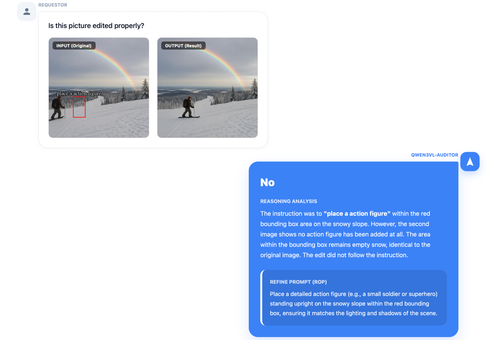

# 🔍 Edit Discriminator
Edit Discriminator is an automated Quality Assurance (QA) toolkit for AIGC image editing tasks. Powered by the Qwen3-VL multimodal model, it evaluates instruction following, local consistency, and global preservation, providing both a confidence score and a Refinement Prompt for failed edits.



---

## 🌟 Key Features

- **Automated Audit**: Replaces manual inspection by judging whether an edit strictly follows the user instruction.
- **Early Exit Pipeline (Speed Boost)**: Employs a dynamic routing mechanism. If an image passes the initial logit-based scoring threshold, it bypasses heavy auto-regressive text generation, massively accelerating large-scale evaluations.
- **Confidence Scoring**: Uses logit-based relative difference between "Yes" and "No" tokens to provide a reliable quality score.
- **Refinement Loop**: Automatically generates a precise "Refinement Prompt" to guide the diffusion model in fixing errors.
- **Robust Data Flow**: Built-in support for processing paired directories, featuring a `FlexiblePairDataset` that inherently supports seamless multi-GPU sharding (`rank`/`world_size`) and auto-resuming from broken states.


## 🚀 Quick Start

**Installation**

- Python 3.10

1. Clone the repository:
   ```bash
   git clone https://github.com/SuyangLumiere/EditDiscriminator.git
   cd Edit_Discriminator
   ```

2. Install dependencies:
   ```bash
   pip install -r requirements.txt
   ```

**Basic Usage**

- Use the Qwen3VLModel to perform a quick check on a single image pair. Remember you need to provide the original editing instruction if there is:
  ```bash
   python demo.py
  ```

**Large-Scale Batch Processing**

- Perfect for cleaning large-scale synthetic datasets. The toolkit natively supports multi-node/multi-GPU execution via OS-level CUDA visibility and internal dataset splitting:
  ```bash
   # Terminal 1 (GPU 0)
   CUDA_VISIBLE_DEVICES=0 python your_batch_script.py --rank 0 --world_size 2

   # Terminal 2 (GPU 1)
   CUDA_VISIBLE_DEVICES=1 python your_batch_script.py --rank 1 --world_size 2
  ```


## 🛠️ Internal Logic

1. Scoring Mechanism

The auditor doesn't just give a "Yes" or "No". It calculates the confidence score based on the model's logits:

$$\qquad \text{Score}= \frac{P(Yes)−P(No)}{P(No)}$$​	
 
This provides a continuous metric, allowing you to set custom thresholds for data filtering and plot precise PR curves.

2. Refinement Protocol

When an edit fails, the model acts as an expert critic, identifying specific issues (e.g., "color mismatch", "broken textures") and outputs a prompt starting with RP to be fed back into your generation pipeline.


## 📂 Project Structure

```
Edit Discriminator/
├── setup.py                # Package installation script
├── requirements.txt        # Dependencies
├── Qwen3VLAuditor/         # Core package
│   ├── __init__.py         # Interface exports
│   ├── model.py            # Model & Result logic
│   ├── data.py             # Data iteration
│   └── utils.py            # Logging & Helpers
├── demo.py                 # Single inference demo
└── feature_demo.py         # Other feature demo
```

---


## 🤝 Contributing
Feel free to open issues or submit PRs if you have ideas for better system prompts or scoring algorithms!


## Star History

If you find this project helpful or interesting, a star would be greatly appreciated! Your support motivates us to keep improving. ⭐


[](https://www.star-history.com/#SuyangLumiere/Edit_Discriminator&type=date&legend=top-left)
